# Business Process Documentation
# Website Landing Page Showroom Mobil Bekas

---

# Pendahuluan

Dokumen ini menjelaskan alur proses bisnis utama pada Website Landing Page Showroom Mobil Bekas menggunakan dua pendekatan visual:

1. **Flowchart** → menggambarkan alur proses secara sederhana.
2. **BPMN (Business Process Model and Notation)** → menggambarkan proses bisnis berdasarkan aktor (Admin, Sistem, Pengunjung).

Seluruh diagram menggunakan **Mermaid** sehingga dapat langsung digunakan pada GitHub, GitLab, Obsidian, atau editor Markdown yang mendukung Mermaid.

---

# 1. Login

## Flowchart

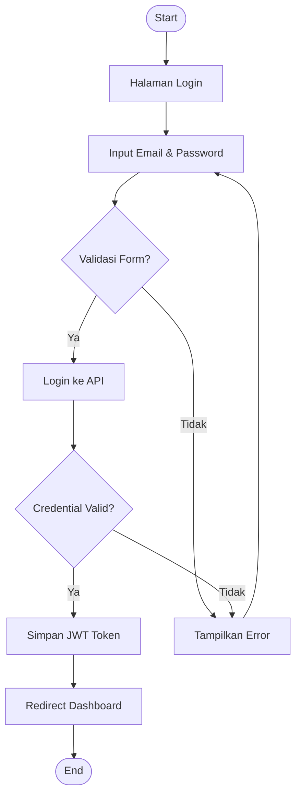

## BPMN

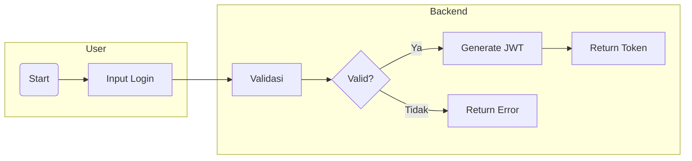

---

# 2. Kelola User

## Flowchart

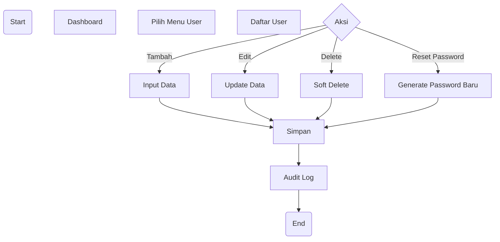

## BPMN

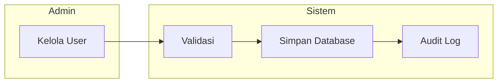

---

# 3. Kelola Branch

## Flowchart

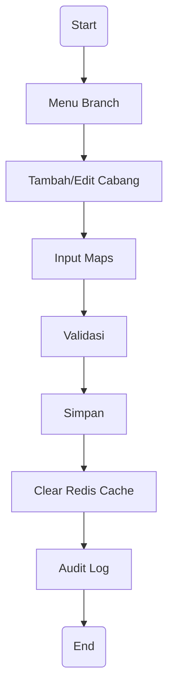

## BPMN

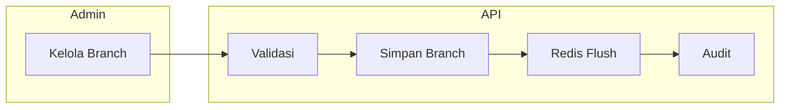

---

# 4. Kelola Product

## Flowchart

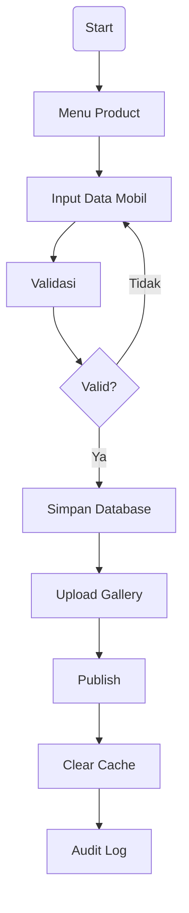

## BPMN

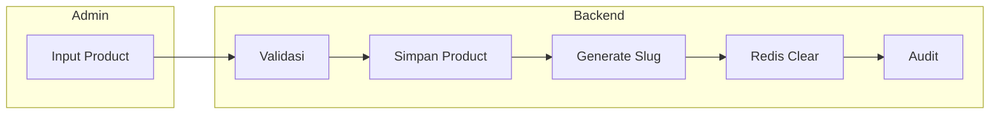

---

# 5. Upload Image

## Flowchart

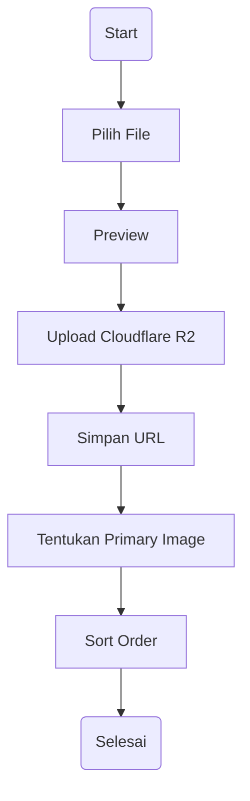

## BPMN

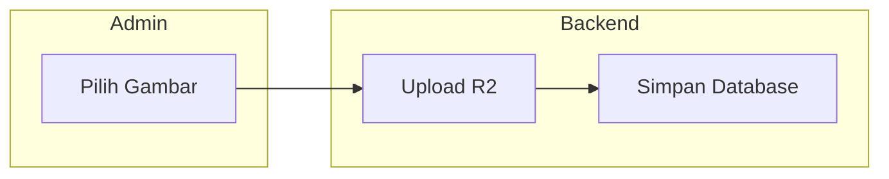

---

# 6. Upload Video

## Flowchart

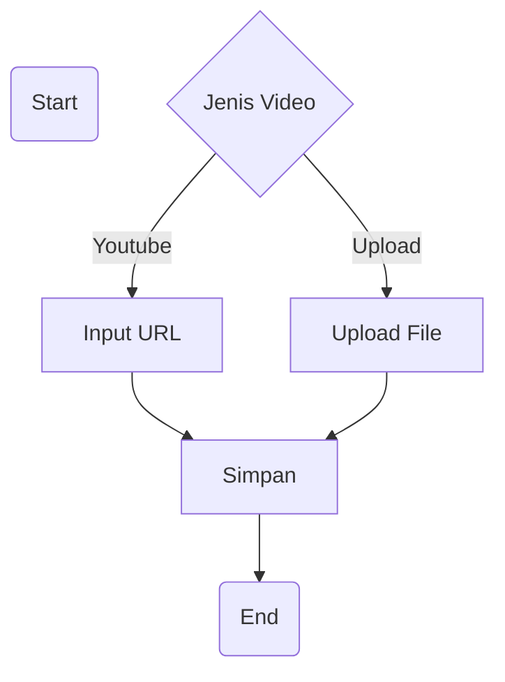

## BPMN

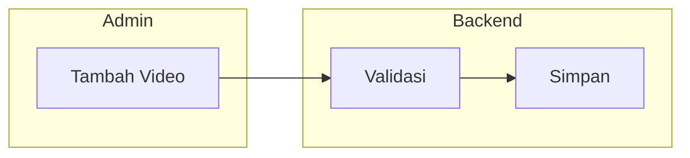

---

# 7. Landing Page

## Flowchart

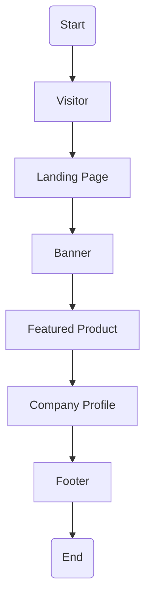

## BPMN

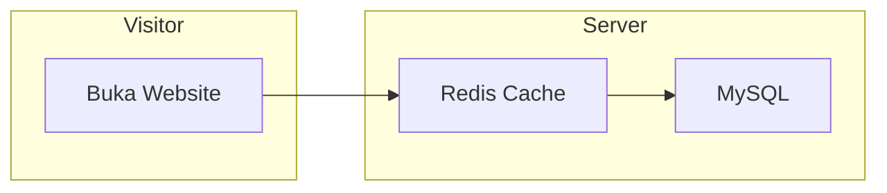

---

# 8. Search Product

## Flowchart

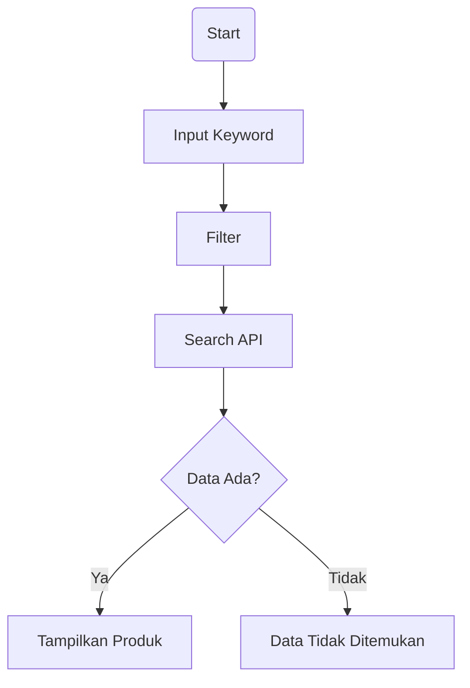

## BPMN

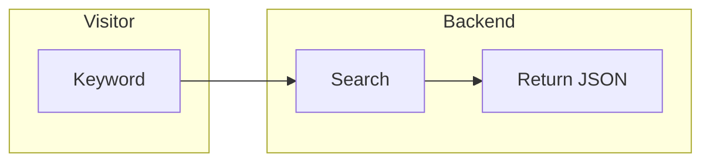

---

# 9. SEO Process

## Flowchart

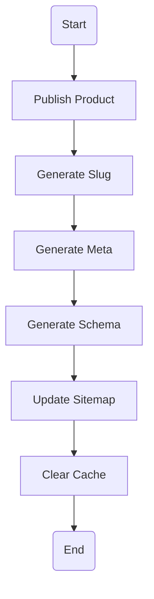

## BPMN

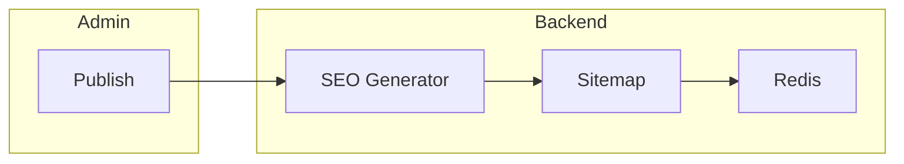

---

# 10. Audit Log

## Flowchart

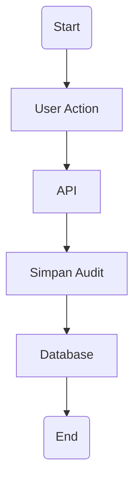

## BPMN

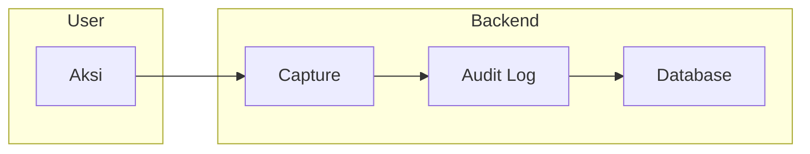

---

# 11. Dashboard

## Flowchart

```mermaid
flowchart TD

A(Start)

B[Login]

C[Dashboard]

D[Load Statistik]

E[Redis]

F{Cache Ada?}

G[Tampilkan]

H[Query Database]

A-->B-->C-->D-->E-->F

F--Ya-->G

F--Tidak-->H-->G
```

## BPMN

```mermaid
flowchart LR

subgraph Admin
A[Buka Dashboard]
end

subgraph Backend
B[Cek Redis]
C[Query Database]
D[Return Statistik]
end

A --> B
B -->|Cache Miss| C
B -->|Cache Hit| D
C --> D
```

---

# Ringkasan Business Process

| No | Proses | Aktor Utama |
|----|---------|-------------|
| 1 | Login | Admin |
| 2 | Kelola User | Super Admin |
| 3 | Kelola Branch | Super Admin |
| 4 | Kelola Product | Admin Cabang |
| 5 | Upload Image | Admin |
| 6 | Upload Video | Admin |
| 7 | Landing Page | Visitor |
| 8 | Search Product | Visitor |
| 9 | SEO Automation | Sistem |
| 10 | Audit Log | Sistem |
| 11 | Dashboard | Admin |
