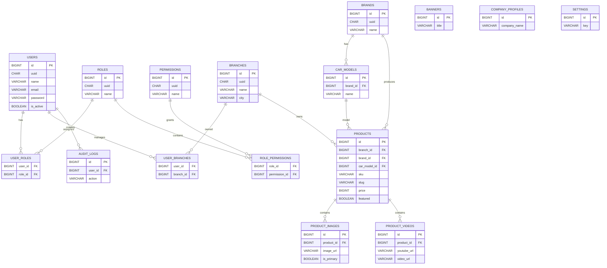

# Entity Relationship Diagram (ERD)
## Website Landing Page Showroom Mobil Bekas

**Database:** MySQL 8.x  
**Engine:** InnoDB  
**Character Set:** utf8mb4  
**Collation:** utf8mb4_unicode_ci

---

# 1. Konsep Database

Database dirancang menggunakan pendekatan **relational database** dengan prinsip normalisasi hingga minimal **Third Normal Form (3NF)**.

Setiap tabel master menggunakan:

- UUID
- Auto Increment ID
- Soft Delete
- Timestamp
- Foreign Key Constraint
- Index
- Audit Ready

---

# 2. Standar Seluruh Tabel

Seluruh tabel master menggunakan field berikut:

| Field | Type | Keterangan |
|---------|------|------------|
| id | BIGINT UNSIGNED | Primary Key |
| uuid | CHAR(36) | UUID v4 |
| created_at | TIMESTAMP | Created Time |
| updated_at | TIMESTAMP | Updated Time |
| deleted_at | TIMESTAMP NULL | Soft Delete |

---

# 3. Master Tables

---

# Users

Menyimpan seluruh akun sistem.

| Field | Type | Constraint |
|---------|------|------------|
| id | BIGINT | PK AI |
| uuid | CHAR(36) | UNIQUE |
| name | VARCHAR(150) | NOT NULL |
| email | VARCHAR(150) | UNIQUE |
| phone | VARCHAR(30) | NULL |
| password | VARCHAR(255) | NOT NULL |
| avatar | VARCHAR(255) | NULL |
| is_active | BOOLEAN | DEFAULT TRUE |
| last_login_at | TIMESTAMP | NULL |
| created_at | TIMESTAMP | |
| updated_at | TIMESTAMP | |
| deleted_at | TIMESTAMP | Soft Delete |

### Index

- PK(id)
- UK(uuid)
- UK(email)
- IDX(is_active)

---

# Roles

| Field | Type |
|---------|------|
| id | BIGINT |
| uuid | CHAR(36) |
| name | VARCHAR(100) |
| description | TEXT |
| created_at | TIMESTAMP |
| updated_at | TIMESTAMP |
| deleted_at | TIMESTAMP |

Index

- PK
- UK(uuid)
- UK(name)

---

# Permissions

| Field | Type |
|---------|------|
| id | BIGINT |
| uuid | CHAR(36) |
| module | VARCHAR(100) |
| name | VARCHAR(150) |
| slug | VARCHAR(150) |
| created_at | TIMESTAMP |
| updated_at | TIMESTAMP |
| deleted_at | TIMESTAMP |

---

# user_roles

Pivot Table

| Field | Type |
|---------|------|
| user_id | BIGINT |
| role_id | BIGINT |

Composite PK

(user_id, role_id)

---

# role_permissions

Pivot

| Field | Type |
|---------|------|
| role_id | BIGINT |
| permission_id | BIGINT |

Composite PK

(role_id, permission_id)

---

# Branches

| Field | Type |
|---------|------|
| id | BIGINT |
| uuid | CHAR(36) |
| code | VARCHAR(20) |
| name | VARCHAR(150) |
| address | TEXT |
| city | VARCHAR(100) |
| province | VARCHAR(100) |
| postal_code | VARCHAR(10) |
| latitude | DECIMAL(10,7) |
| longitude | DECIMAL(10,7) |
| google_maps | TEXT |
| phone | VARCHAR(30) |
| email | VARCHAR(100) |
| is_active | BOOLEAN |
| created_at | TIMESTAMP |
| updated_at | TIMESTAMP |
| deleted_at | TIMESTAMP |

Index

- UK(uuid)
- UK(code)
- IDX(city)

---

# user_branches

Relasi admin dengan cabang.

| Field | Type |
|---------|------|
| user_id | BIGINT |
| branch_id | BIGINT |

Composite PK

(user_id, branch_id)

---

# Brands

| Field | Type |
|---------|------|
| id | BIGINT |
| uuid | CHAR(36) |
| name | VARCHAR(150) |
| slug | VARCHAR(150) |
| logo | VARCHAR(255) |
| description | TEXT |
| is_active | BOOLEAN |
| created_at | TIMESTAMP |
| updated_at | TIMESTAMP |
| deleted_at | TIMESTAMP |

---

# Car Models

| Field | Type |
|---------|------|
| id | BIGINT |
| uuid | CHAR(36) |
| brand_id | BIGINT |
| name | VARCHAR(150) |
| slug | VARCHAR(150) |
| created_at | TIMESTAMP |
| updated_at | TIMESTAMP |
| deleted_at | TIMESTAMP |

FK

brand_id → brands.id

---

# Products

Merupakan tabel utama.

| Field | Type |
|---------|------|
| id | BIGINT |
| uuid | CHAR(36) |
| branch_id | BIGINT |
| brand_id | BIGINT |
| car_model_id | BIGINT |
| sku | VARCHAR(50) |
| slug | VARCHAR(200) |
| title | VARCHAR(255) |
| year | YEAR |
| color | VARCHAR(100) |
| transmission | ENUM |
| fuel_type | ENUM |
| engine | VARCHAR(100) |
| engine_capacity | INT |
| mileage | INT |
| price | BIGINT |
| description | LONGTEXT |
| featured | BOOLEAN |
| publish_status | ENUM |
| published_at | TIMESTAMP |
| seo_title | VARCHAR(255) |
| seo_description | TEXT |
| og_image | VARCHAR(255) |
| canonical_url | VARCHAR(255) |
| created_by | BIGINT |
| updated_by | BIGINT |
| created_at | TIMESTAMP |
| updated_at | TIMESTAMP |
| deleted_at | TIMESTAMP |

Index

- UK(uuid)
- UK(sku)
- UK(slug)
- IDX(price)
- IDX(featured)
- IDX(branch_id)
- IDX(brand_id)
- IDX(car_model_id)

---

# Product Images

Multiple Images

| Field | Type |
|---------|------|
| id | BIGINT |
| uuid | CHAR(36) |
| product_id | BIGINT |
| image_url | VARCHAR(255) |
| is_primary | BOOLEAN |
| sort_order | INT |
| created_at | TIMESTAMP |
| updated_at | TIMESTAMP |
| deleted_at | TIMESTAMP |

---

# Product Videos

| Field | Type |
|---------|------|
| id | BIGINT |
| uuid | CHAR(36) |
| product_id | BIGINT |
| type | ENUM(YOUTUBE,UPLOAD) |
| youtube_url | VARCHAR(255) |
| video_url | VARCHAR(255) |
| thumbnail | VARCHAR(255) |
| sort_order | INT |
| created_at | TIMESTAMP |
| updated_at | TIMESTAMP |
| deleted_at | TIMESTAMP |

---

# Banners

| Field | Type |
|---------|------|
| id | BIGINT |
| uuid | CHAR(36) |
| title | VARCHAR(255) |
| image | VARCHAR(255) |
| url | VARCHAR(255) |
| publish_start | DATETIME |
| publish_end | DATETIME |
| sort_order | INT |
| is_active | BOOLEAN |
| created_at | TIMESTAMP |
| updated_at | TIMESTAMP |
| deleted_at | TIMESTAMP |

---

# Company Profiles

Karena hanya terdapat satu profil perusahaan, relasinya **One-to-One** secara logis dengan aplikasi (singleton).

| Field | Type |
|---------|------|
| id | BIGINT |
| uuid | CHAR(36) |
| company_name | VARCHAR(255) |
| about | LONGTEXT |
| vision | LONGTEXT |
| mission | LONGTEXT |
| address | TEXT |
| email | VARCHAR(100) |
| phone | VARCHAR(30) |
| maps_embed | LONGTEXT |
| logo | VARCHAR(255) |
| favicon | VARCHAR(255) |
| created_at | TIMESTAMP |
| updated_at | TIMESTAMP |

---

# Settings

| Field | Type |
|---------|------|
| id | BIGINT |
| key | VARCHAR(100) |
| value | LONGTEXT |
| type | VARCHAR(50) |
| is_public | BOOLEAN |
| created_at | TIMESTAMP |
| updated_at | TIMESTAMP |

---

# Audit Logs

| Field | Type |
|---------|------|
| id | BIGINT |
| uuid | CHAR(36) |
| user_id | BIGINT |
| module | VARCHAR(100) |
| action | VARCHAR(50) |
| url | TEXT |
| method | VARCHAR(20) |
| ip_address | VARCHAR(45) |
| user_agent | TEXT |
| old_values | JSON |
| new_values | JSON |
| created_at | TIMESTAMP |

---

# 4. Relasi Database

## One To One

- Application → Company Profile (Singleton)

---

## One To Many

- Branch → Products
- Brand → Car Models
- Brand → Products
- Car Model → Products
- Product → Images
- Product → Videos
- User → Audit Logs

---

## Many To Many

Users ↔ Roles

Roles ↔ Permissions

Users ↔ Branches

---

# 5. ER Diagram (Mermaid)

---

# 6. Strategi Indexing

| Tabel | Index |
|--------|-------|
| users | email, uuid |
| roles | name |
| permissions | slug |
| branches | code, city |
| brands | slug |
| car_models | brand_id |
| products | sku, slug, branch_id, brand_id, car_model_id, featured, publish_status, price |
| product_images | product_id, is_primary |
| product_videos | product_id |
| banners | publish_start, publish_end |
| settings | key |
| audit_logs | user_id, created_at |

---

# 7. Catatan Desain

1. Seluruh master data menggunakan **UUID** sebagai identifier publik dan **BIGINT** sebagai primary key internal untuk performa join.
2. Seluruh tabel utama mendukung **Soft Delete** (`deleted_at`) agar data dapat dipulihkan dan menjaga integritas audit.
3. Setiap **Foreign Key** menggunakan `ON UPDATE CASCADE` dan disarankan `ON DELETE RESTRICT` untuk data master, sementara tabel turunan seperti `product_images` dan `product_videos` dapat menggunakan `ON DELETE CASCADE`.
4. Kolom yang sering digunakan untuk pencarian (`slug`, `sku`, `email`, `code`) wajib memiliki **UNIQUE INDEX**.
5. Struktur ini telah disiapkan untuk pengembangan lanjutan seperti marketplace, transaksi penjualan, reservasi kendaraan, test drive, wishlist, dan integrasi pembayaran tanpa memerlukan perubahan besar pada skema inti.
