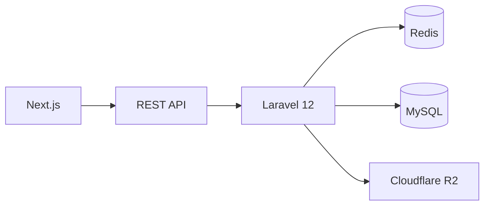
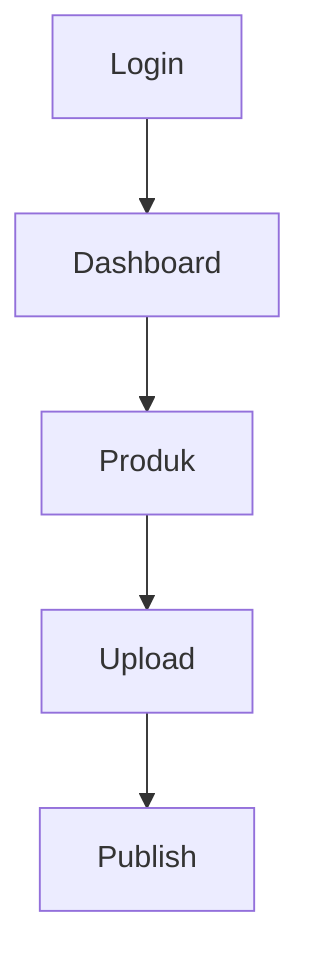

# Software Requirement Specification (SRS)

> **Nama Proyek:** Website Landing Page Showroom Mobil Bekas  
> **Versi:** 1.0.0  
> **Tanggal:** 2026-07-02  
> **Penyusun:** ChatGPT (Senior Software Architect)  
> **Status:** Draft

> **Catatan:** Dokumen lengkap sesuai ruang lingkup yang diminta (15 bab, >50 FR, ERD lengkap, seluruh modul) akan berukuran puluhan ribu kata. File ini merupakan kerangka SRS siap dikembangkan di repository.

## Daftar Isi
1. Pendahuluan
2. Gambaran Umum Sistem
3. Arsitektur Sistem
4. Teknologi
5. Modul Sistem
6. Hak Akses
7. Business Rule
8. Functional Requirement
9. Non Functional Requirement
10. Database Concept
11. User Flow
12. Integrasi
13. Standar API
14. Roadmap
15. Kesimpulan

# 1 Pendahuluan

## Latar Belakang
Website digunakan sebagai company profile dan katalog kendaraan bekas berbasis Headless Architecture.

## Tujuan
- Menampilkan stok mobil seluruh cabang.
- SEO Friendly.
- Siap dikembangkan menjadi marketplace.

# 2 Gambaran Umum Sistem

# 3 Arsitektur Sistem
Frontend hanya berkomunikasi dengan Backend melalui REST API.

# 4 Teknologi

| Teknologi | Fungsi |
|-----------|--------|
| Next.js | Frontend |
| Laravel 12 | Backend API |
| MySQL | Database |
| Redis | Cache |
| Cloudflare R2 | Storage |

# 5 Modul Sistem
- Authentication
- User Management
- Role Management
- Permission Management
- Branch Management
- Brand Management
- Car Model Management
- Product Management
- Gallery
- Banner
- Company Profile
- Dashboard
- SEO
- Audit Log
- Settings

# 6 Hak Akses
RBAC:
- Super Admin
- Admin Cabang

# 7 Business Rule
- UUID seluruh master data.
- Soft Delete.
- Slug unik.
- Produk wajib memiliki Branch, Brand, Model.
- Upload ke Cloudflare R2.
- Redis di-clear setelah perubahan data.

# 8 Functional Requirement
- FR-001 Login
- FR-002 Logout
- FR-003 CRUD User
- FR-004 CRUD Produk
- FR-005 Publish Produk
- dst.

# 9 Non Functional Requirement
- Performance
- Security
- Scalability
- Maintainability
- Availability

# 10 Database Concept
Entity utama:
Users, Roles, Permissions, Branches, Brands, CarModels, Products, ProductImages, ProductVideos, Settings, AuditLogs.

# 11 User Flow

# 12 Integrasi
Google Maps, Redis, Cloudflare R2, WhatsApp, Google Analytics, Facebook Pixel.

# 13 Standar API
Base URL: `/api/v1`

# 14 Roadmap
1. Authentication
2. Master Data
3. Produk
4. Landing Page
5. Optimisasi

# 15 Kesimpulan
Dokumen ini menjadi dasar implementasi sistem showroom mobil berbasis Headless Architecture.
